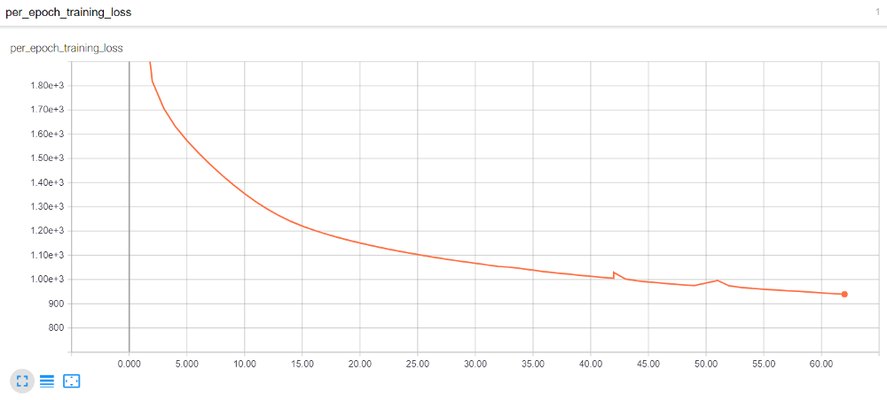
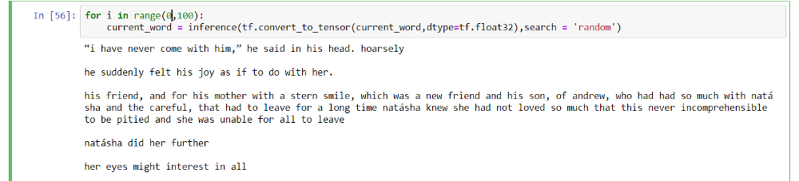
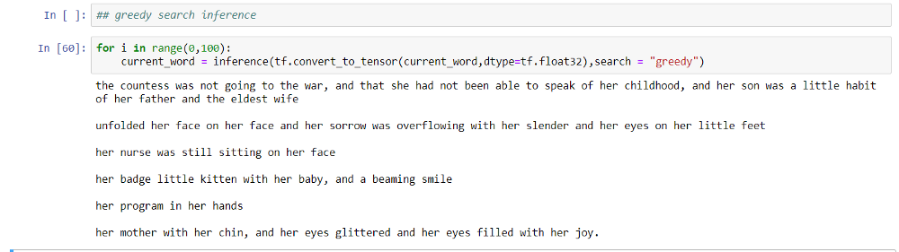

# Language_model
Tensorflow Eager implementation for text generation.

Text generation is a task in which we generate sentences based on the probability distribution of words learnt by the model from the training data. We trained our model on Leo Tolstoy’s War and Peace so it can understand the style of his writing and try to generate new sentences.

Tensorflow Eager provides the flexibility to use Tensorflow without using graphs, so we can build graphs on the fly during run time. 

# Required Tools

Jupyter Notebook

Numpy

Pandas

Gensim

Tensorflow

Tensorboard

# Quick Start

It is a very complex model and takes a lot of time to train. We trained the model for over 50 epochs and saved the weights. If you want to replicate the same model you can download the weights provided and run it.

To use our saved weights:

1. Download the model weights by cloning or downloading the repository
2. Run in terminal - git clone https://github.com/pujitha7/Language_model.git
2. Download Word2vec weights from this link as it is >25mb. https://drive.google.com/open?id=1564D9AKSgd6l4J5p-APVUHXpDlxn2PLk
3. Copy and paste word2vec.model weights downloaded from above link to Language_model folder.
4. cd Langauge_model
5. python language_model_main.py

To run your own model:

1. Clone or Download the repository.
2. cd Langauge_model
3. Uncomment some parts of code to train your own model.
4. Run the code using .py or in Jupyter notebook

# Files Uploaded

language_model_main.ipynb - Code in Jupyter notebook

language_model_main.py - Code in .py file

war_peace.txt - Dataset

weights61.data-00000-of-00001 - Our trained model weights - if you want to train your own model you can ignore this.

weights61.index - Our trained model weights - if you want to train your own model you can ignore this.

word2vec_tes.model - Trained Word2Vec model - if you want to train your own model you can ignore this.

word2vec.model - Available at the link https://drive.google.com/open?id=1564D9AKSgd6l4J5p-APVUHXpDlxn2PLk it is word2vec trained model - if you want to train your own model you can ignore this.

# Performance

Loss over epochs

Generating text using Random Search

Generating text using Greedy Search

